<p align="center">
  
</p>

<h1 align="center">AgentHub</h1>

<p align="center">
  <strong>把 Claude Code 与 Codex 留在自己的电脑上，把控制权带到任何设备。</strong>
</p>

<p align="center">
  面向手机、Web、桌面端和自动化脚本的开源 AI 编码代理控制中心。
</p>

<p align="center">
  <a href="https://github.com/dckill/AgentHub/actions/workflows/typecheck.yml"></a>
  <a href="https://www.npmjs.com/package/@artsum/agenthub"></a>
  <a href="https://github.com/dckill/AgentHub/stargazers"></a>
  <a href="LICENSE"></a>
  
</p>

<p align="center">
  
</p>

AgentHub 在你的电脑上启动并管理 Claude Code 或 Codex，通过端到端加密把会话状态同步到手机、浏览器或桌面客户端。你可以离开工位后继续对话、批准工具调用、检查 Git 变更、浏览机器文件，或者从另一台终端自动化控制会话。

## 为什么是 AgentHub

- **代理仍在本机运行**：代码、工具链和工作目录不必迁移到陌生的远程执行环境。
- **真正的跨设备接管**：在手机、Web、桌面端查看在线机器，创建、恢复、接管或停止会话。
- **专注两个生产运行时**：当前明确支持 Claude Code 与 Codex，不提供无法维护的“万能 Provider”抽象。
- **端到端加密同步**：服务端负责认证、转发和持久化，加密域与密钥材料由客户端管理。
- **不仅是聊天窗口**：内置项目工作台、权限审批、Markdown/Mermaid、Git、文件、Artifacts 与用量视图。
- **可自托管、可自动化**：Server 支持标准部署和轻量 standalone 模式，`agenthub-agent` 可从脚本远程控制机器与会话。

## 产品界面

以下展示来自 Android 真机页面。隐私相关的主机名、工作路径和进程号已替换为安全示例；内容较少的仪表盘与会话页只复用了页面现有的分组、机器行、项目和会话卡片进行补充，没有添加不存在的功能。所有原始截图均为 **1080 × 2376**，点击手机可查看完整页面。

> 左右拖动下方图片轨道查看更多；深色与浅色主题、会话工具调用、文件预览和 Git 变更均来自同一套真实界面。

<table>
  <tr>
    <td align="center" width="250" nowrap><a href="docs/assets/readme/showcase/screens/设备页面-亮.jpg">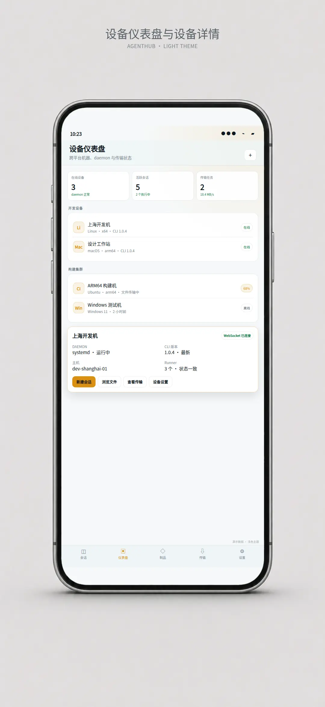</a><br><sub><strong>仪表盘 · 浅色</strong><br>设备分组与在线状态</sub></td>
    <td align="center" width="250" nowrap><a href="docs/assets/readme/showcase/screens/设备页面-暗.jpg">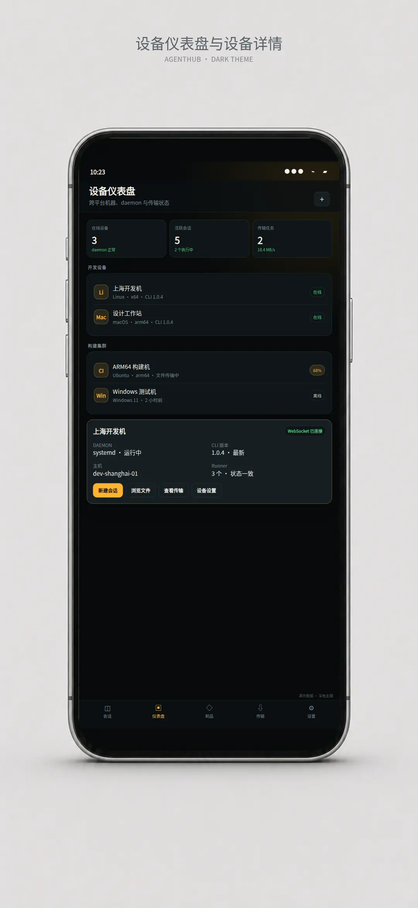</a><br><sub><strong>仪表盘 · 深色</strong><br>多机器与离线状态</sub></td>
    <td align="center" width="250" nowrap><a href="docs/assets/readme/showcase/screens/会话页面-暗.jpg">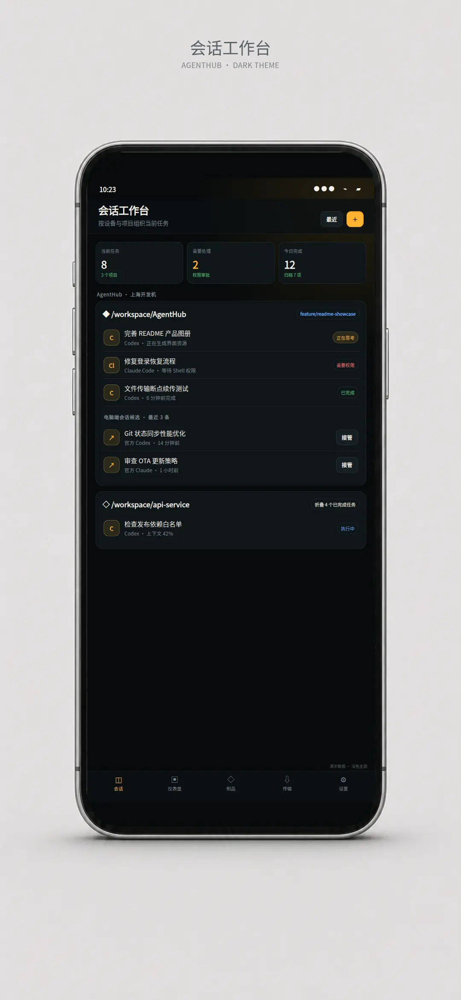</a><br><sub><strong>会话中心</strong><br>项目、分支与会话状态</sub></td>
    <td align="center" width="250" nowrap><a href="docs/assets/readme/showcase/screens/新建会话-亮.jpg">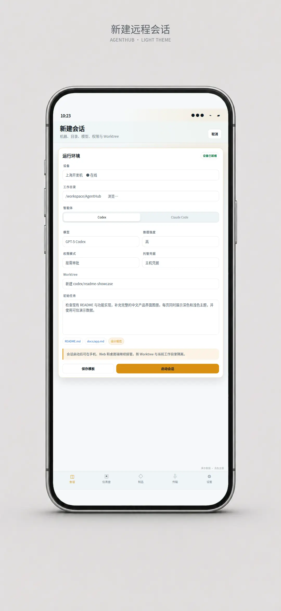</a><br><sub><strong>新建会话 · 浅色</strong><br>设备、目录与模型</sub></td>
    <td align="center" width="250" nowrap><a href="docs/assets/readme/showcase/screens/新建会话-暗.jpg">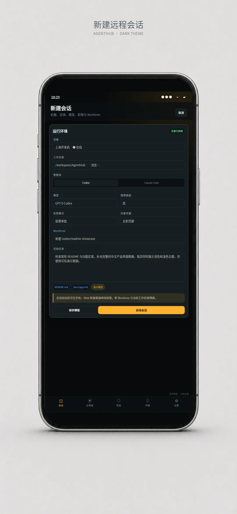</a><br><sub><strong>新建会话 · 深色</strong><br>权限、凭据与 Worktree</sub></td>
    <td align="center" width="250" nowrap><a href="docs/assets/readme/showcase/screens/对话页面-亮.jpg">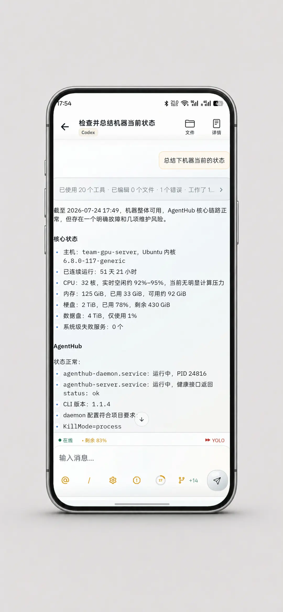</a><br><sub><strong>对话总结 · 浅色</strong><br>Markdown 与运行状态</sub></td>
    <td align="center" width="250" nowrap><a href="docs/assets/readme/showcase/screens/对话页面-暗.jpg"></a><br><sub><strong>工具调用 · 深色</strong><br>终端执行与完成状态</sub></td>
    <td align="center" width="250" nowrap><a href="docs/assets/readme/showcase/screens/对话页面-对话折叠.jpg">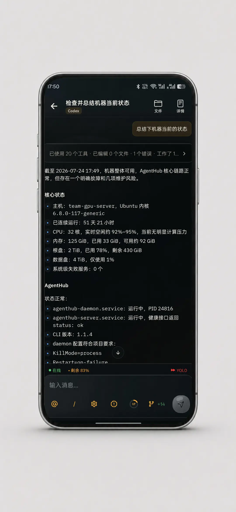</a><br><sub><strong>折叠工具详情</strong><br>聚合用量与错误信息</sub></td>
    <td align="center" width="250" nowrap><a href="docs/assets/readme/showcase/screens/文件管理-暗.jpg">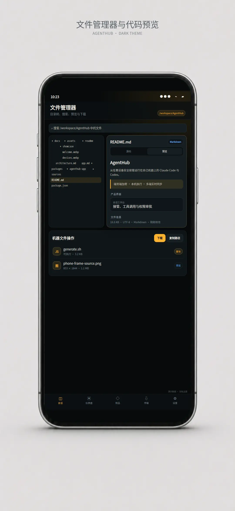</a><br><sub><strong>文件管理器</strong><br>搜索、目录与文件类型</sub></td>
    <td align="center" width="250" nowrap><a href="docs/assets/readme/showcase/screens/文件查看-暗.jpg"></a><br><sub><strong>文件预览</strong><br>源码、预览与下载</sub></td>
    <td align="center" width="250" nowrap><a href="docs/assets/readme/showcase/screens/Git管理-亮.jpg">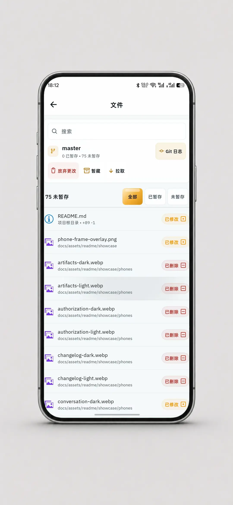</a><br><sub><strong>Git 管理 · 浅色</strong><br>暂存、拉取与文件状态</sub></td>
    <td align="center" width="250" nowrap><a href="docs/assets/readme/showcase/screens/Git管理-暗.jpg">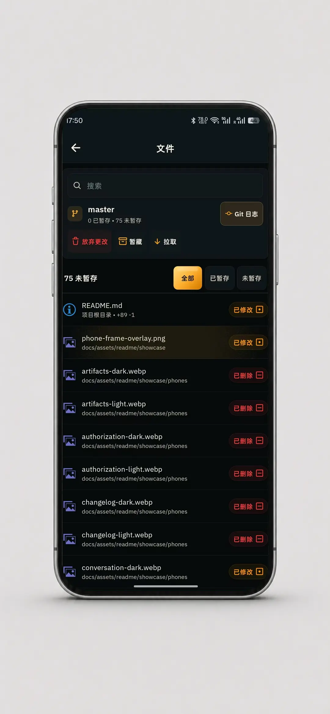</a><br><sub><strong>Git 管理 · 深色</strong><br>变更筛选与状态标记</sub></td>
    <td align="center" width="250" nowrap><a href="docs/assets/readme/showcase/screens/Git-diff.jpg">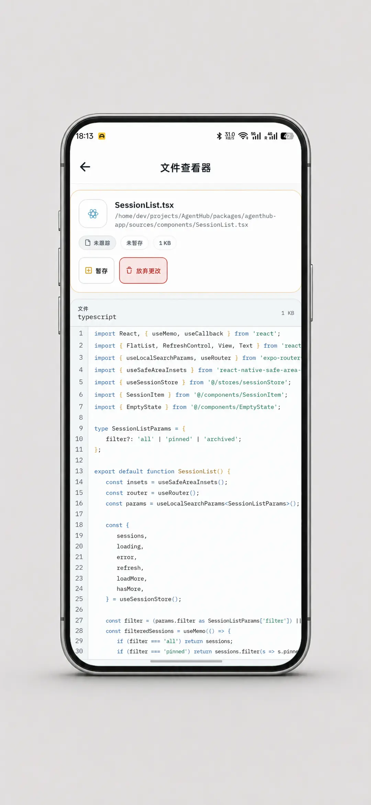</a><br><sub><strong>Git 文件查看</strong><br>语法高亮与暂存操作</sub></td>
    <td align="center" width="250" nowrap><a href="docs/assets/readme/showcase/screens/设置页面-亮.jpg">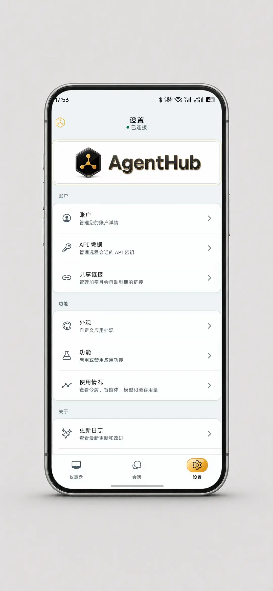</a><br><sub><strong>设置 · 浅色</strong><br>账户、凭据与共享链接</sub></td>
    <td align="center" width="250" nowrap><a href="docs/assets/readme/showcase/screens/设置页面-暗.jpg">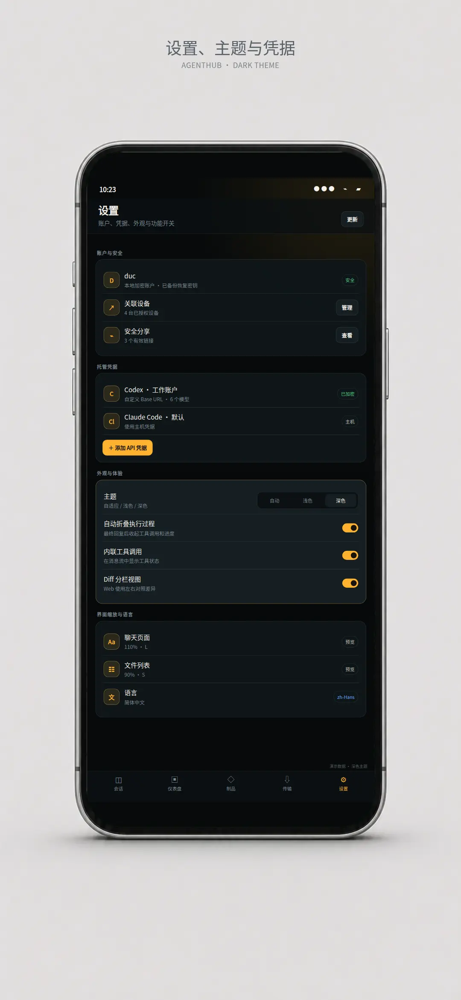</a><br><sub><strong>设置 · 深色</strong><br>外观、功能与更新</sub></td>
  </tr>
</table>


## 3 分钟开始

### 1. 准备本机环境

需要 Node.js 20 或更高版本，并至少安装一个受支持的官方 CLI：

```bash
claude --version
codex --version
```

### 2. 安装 AgentHub CLI

```bash
npm install -g @artsum/agenthub
```

### 3. 登录并接入机器

```bash
agenthub auth login
agenthub auth status
agenthub daemon status
```

首次登录会通过二维码绑定账号，并自动检查当前平台的 daemon 自启动与运行状态。需要手动管理常驻服务时可运行：

```bash
agenthub daemon install
agenthub daemon list
```

### 4. 启动编码代理

```bash
agenthub              # 默认启动 Claude Code
agenthub claude       # 显式启动 Claude Code
agenthub codex        # 启动 Codex
```

在手机、Web 或桌面客户端登录同一账号，即可继续会话。更完整的登录、凭据和远程恢复说明见[快速开始](docs/getting-started.md)。

## 核心能力

| 场景 | 能力 |
| --- | --- |
| 会话工作台 | 按机器和项目组织任务，支持最近会话、高级恢复、官方会话接管、归档与删除。 |
| Claude Code / Codex | 本地或远程创建会话，处理权限请求；Codex 支持动态模型目录、steer、fork 与官方线程恢复。 |
| 机器与文件 | 查看在线机器、远程 RPC、目录浏览、分块下载、暂停重试与断线续传。 |
| 开发上下文 | 在会话内查看 Markdown、Mermaid、工具调用、Git status/diff/log、文件内容与 Artifacts。 |
| 加密数据 | 端到端加密会话、托管凭据、用户 KV，以及可设置有效期和随时撤销的加密文本分享。 |
| 跨平台常驻 | Linux systemd、macOS LaunchAgent、Windows 登录计划任务，以及带检查和回滚的 CLI 自更新。 |
| 自动化控制 | 使用 `agenthub-agent` 列出机器与会话，执行 spawn、send、history、wait 和 stop。 |

完整的能力、实现入口和专题文档对应关系见[功能与代码映射](docs/feature-map.md)。

## 工作原理

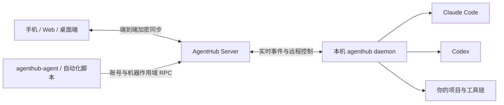

<details>
<summary><strong>查看 AgentHub 完整架构图</strong></summary>
<br>
<a href="docs/assets/diagrams/agenthub-full-architecture.webp">
  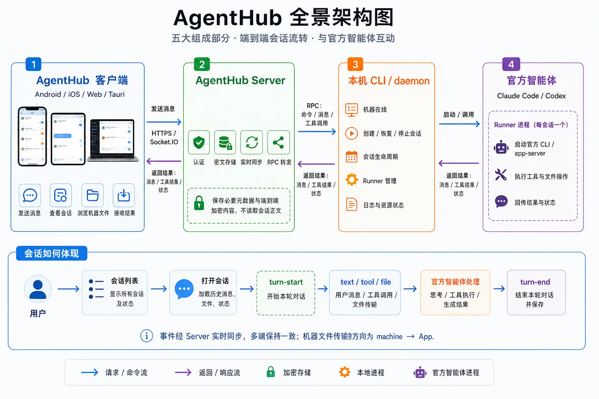
</a>
</details>

- **客户端**保存账号密钥和 UI 状态，拉取快照并接收实时更新。
- **Server**负责认证、路由、排序、密文持久化和多端广播。
- **daemon / runner**在目标机器上启动代理、执行 RPC，并收敛会话生命周期。

详细的数据流、协议和信任边界见[系统架构](docs/architecture.md)、[实时同步与 RPC](docs/realtime-sync-and-rpc.md)和[端到端加密](docs/encryption.md)。

## 自托管

AgentHub Server 提供两种部署形态：

- **标准部署**：PostgreSQL、Redis、S3 兼容对象存储，适合长期运行和横向扩展。
- **Standalone**：PGlite 与本地文件存储，适合个人实例和低门槛试用。

生产环境变量、迁移、反向代理、容器和 systemd 配置见[部署指南](docs/deployment.md)。安全问题请按照[安全政策](SECURITY.md)私下报告。

## 从源码开发

这是一个 pnpm monorepo：

| 组件 | 路径 | 说明 |
| --- | --- | --- |
| App | `packages/agenthub-app` | Expo / React Native / Web / Tauri 客户端。 |
| CLI | `packages/agenthub-cli` | `agenthub` 命令、daemon、runner 生命周期和远程 RPC。 |
| Server | `packages/agenthub-server` | Fastify、Socket.IO、Prisma/PGlite、对象存储和同步 API。 |
| Wire | `packages/agenthub-wire` | 多端共享 Zod schema 与 TypeScript 协议类型。 |
| Agent | `packages/agenthub-agent` | 独立远程控制 CLI。 |

```bash
npx -y pnpm@10.11.0 install
npx -y pnpm@10.11.0 check
npx -y pnpm@10.11.0 web:contract:test
```

开发环境、测试入口和 Android 构建方式见[本地开发环境](docs/dev-environments.md)与[贡献指南](docs/CONTRIBUTING.md)。

## 文档

- [文档索引](docs/README.md)
- [快速开始](docs/getting-started.md)
- [项目当前状态](docs/project-status.md)
- [功能与代码映射](docs/feature-map.md)
- [系统架构](docs/architecture.md)
- [CLI 与 daemon](docs/cli.md)
- [App 架构](docs/app.md)
- [Server 架构](docs/server.md)
- [部署指南](docs/deployment.md)
- [开源发布准备](docs/open-source-release.md)
- [隐私政策](PRIVACY.md)
- [安全政策](SECURITY.md)

## 贡献与许可证

欢迎提交 Issue 和 Pull Request。开始前请先阅读[贡献指南](docs/CONTRIBUTING.md)。

AgentHub 的新增贡献以 [Apache License 2.0](LICENSE) 发布。项目基于 [Happy](https://github.com/slopus/happy) 演进，其原始 MIT 许可证和版权通知继续保留在 [LICENSE-MIT](LICENSE-MIT) 与 [NOTICE](NOTICE) 中。
