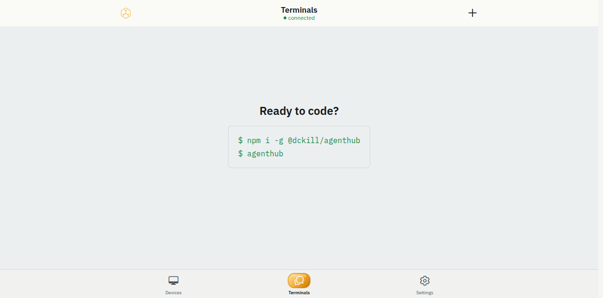

# AgentHub

AgentHub 是一个面向 AI 编码代理的移动端、Web 端、桌面端和远程控制客户端。它把 Claude Code 与 Codex 运行在你自己的电脑上，通过端到端加密同步到手机、浏览器或远程控制 CLI。



## 当前 1.0 状态

- 产品名：`AgentHub`。
- 默认服务端：`https://agenthub.yzsd.asia:8443`。
- Android preview 包名：`com.artsum.agenthub.preview`。
- App 版本：`1.0.0`，`runtimeVersion=1`。
- CLI 包名：`@artsum/agenthub`，当前版本 `1.1.4`，安装后命令为 `agenthub`。
- 本机数据目录：`~/.agenthub`，环境变量统一使用 `AGENTHUB_*`。
- Linux 常驻服务：`agenthub-server.service` 和 `agenthub-daemon.service`。

## 快速开始

安装 CLI：

```bash
npm install -g @artsum/agenthub
```

登录账号并启动本机 daemon：

```bash
agenthub auth login
agenthub daemon install
systemctl --user status agenthub-daemon.service --no-pager
```

启动编码代理：

```bash
agenthub claude
agenthub codex
```

手机端或 Web 端登录同一账号后，可以查看在线机器、远程创建会话、审批权限、查看 Git 变更、浏览文件和继续长会话。

## 项目组件

| 组件 | 路径 | 说明 |
| --- | --- | --- |
| App | `packages/agenthub-app` | Expo / React Native / Web / Tauri 客户端。 |
| CLI | `packages/agenthub-cli` | `agenthub` 命令、daemon、runner 生命周期和远程 RPC。 |
| Server | `packages/agenthub-server` | Fastify、Socket.IO、Prisma/PGlite、对象存储和同步 API。 |
| Wire | `packages/agenthub-wire` | 多端共享 Zod schema 与 TypeScript 协议类型。 |
| Agent | `packages/agenthub-agent` | 独立远程控制 CLI，用于列机器、spawn、send、history、wait。 |

## 开发与验证

```bash
npx -y pnpm@10.11.0 install
npx -y pnpm@10.11.0 check
npx -y pnpm@10.11.0 web:contract:test
```

Web 与 UI 改动默认使用组件、状态机、语义/无障碍和 production build 自动化验证，不要求浏览器截图。Android 本地包统一输出到根目录 `artifacts/`：

```bash
npx -y pnpm@10.11.0 --filter agenthub-app android:preview:apk:arm64
```

产物命名：

```text
artifacts/agenthub-preview-arm64-YYYYMMDD-HHMM.apk
artifacts/agenthub-preview-arm64-latest.apk
```

## 文档

- [文档索引](docs/README.md)
- [项目当前状态](docs/project-status.md)
- [部署指南](docs/deployment.md)
- [本地开发环境](docs/dev-environments.md)
- [开源发布准备](docs/open-source-release.md)
- [设计系统](design/Design.md)
- [贡献指南](docs/CONTRIBUTING.md)
- [安全政策](SECURITY.md)
- [隐私政策](PRIVACY.md)

## 来源与许可证

AgentHub 基于 [Happy](https://github.com/slopus/happy) 演进，保留其 MIT 许可证和原始贡献者版权通知。当前仓库同样以 MIT 许可证发布，详见 [LICENSE](LICENSE) 和 [NOTICE](NOTICE)。
