<p align="center">
  
</p>

<h1 align="center">AgentHub</h1>

<p align="center">
  <strong>把 Claude Code 与 Codex 留在自己的电脑上，把控制权带到任何设备。</strong>
</p>

<p align="center">
  面向手机、Web、桌面端和自动化脚本的开源 AI 编码代理控制中心。
</p>

<p align="center">
  <a href="https://github.com/dckill/AgentHub/actions/workflows/typecheck.yml"></a>
  <a href="https://www.npmjs.com/package/@artsum/agenthub"></a>
  <a href="https://github.com/dckill/AgentHub/stargazers"></a>
  <a href="LICENSE"></a>
  
</p>

<p align="center">
  
</p>

AgentHub 在你的电脑上启动并管理 Claude Code 或 Codex，通过端到端加密把会话状态同步到手机、浏览器或桌面客户端。你可以离开工位后继续对话、批准工具调用、检查 Git 变更、浏览机器文件，或者从另一台终端自动化控制会话。

## 为什么是 AgentHub

- **代理仍在本机运行**：代码、工具链和工作目录不必迁移到陌生的远程执行环境。
- **真正的跨设备接管**：在手机、Web、桌面端查看在线机器，创建、恢复、接管或停止会话。
- **专注两个生产运行时**：当前明确支持 Claude Code 与 Codex，不提供无法维护的“万能 Provider”抽象。
- **端到端加密同步**：服务端负责认证、转发和持久化，加密域与密钥材料由客户端管理。
- **不仅是聊天窗口**：内置项目工作台、权限审批、Markdown/Mermaid、Git、文件、Artifacts 与用量视图。
- **可自托管、可自动化**：Server 支持标准部署和轻量 standalone 模式，`agenthub-agent` 可从脚本远程控制机器与会话。

## 产品界面

以下界面使用与现有功能一致的中文演示数据，同时展示 Amber Crystal 深色与浅色主题。点击手机模型可查看对应的 **1080 × 2338** 原始页面。

### 接入与设备

#### 欢迎与创建账户

未登录用户可以创建本地加密账户、关联或恢复已有账户，也可以切换到自己的 AgentHub Server。

<table>
  <tr>
    <td align="center" width="50%">
      <a href="docs/assets/readme/showcase/screens/welcome-dark.webp">
        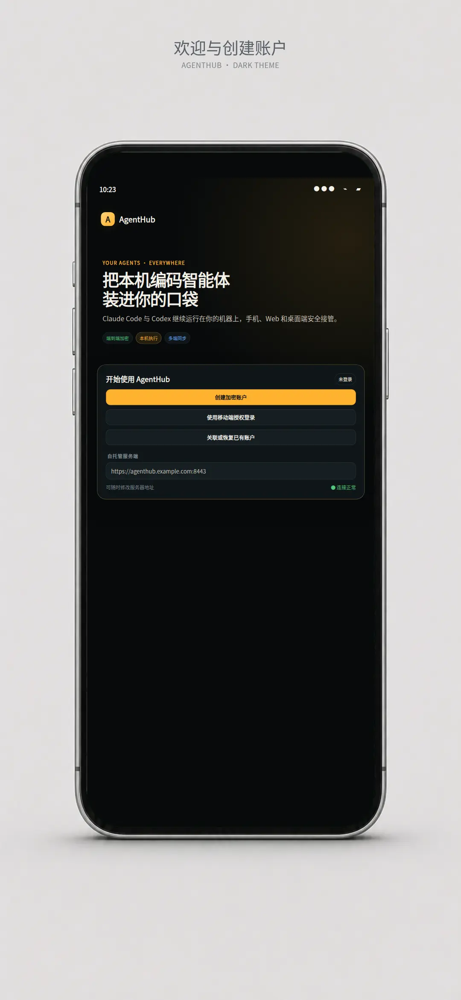
      </a>
      <br>
      <sub><strong>深色主题</strong> — 创建账户、授权登录、账户恢复与自托管服务端。</sub>
    </td>
    <td align="center" width="50%">
      <a href="docs/assets/readme/showcase/screens/welcome-light.webp">
        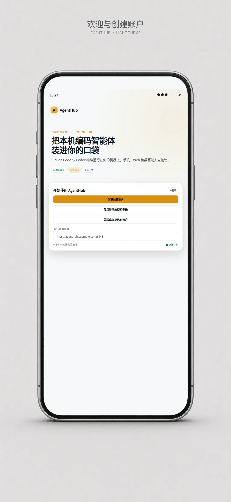
      </a>
      <br>
      <sub><strong>浅色主题</strong> — 连接状态、Server 地址和端到端加密定位。</sub>
    </td>
  </tr>
</table>

#### 设备授权与账户恢复

临时公钥二维码用于关联新设备，也可以改用恢复密钥；服务端不会获得账户解密密钥。

<table>
  <tr>
    <td align="center" width="50%">
      <a href="docs/assets/readme/showcase/screens/authorization-dark.webp">
        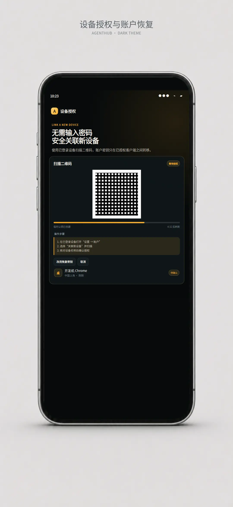
      </a>
      <br>
      <sub><strong>深色主题</strong> — 二维码授权、倒计时、请求设备和安全说明。</sub>
    </td>
    <td align="center" width="50%">
      <a href="docs/assets/readme/showcase/screens/authorization-light.webp">
        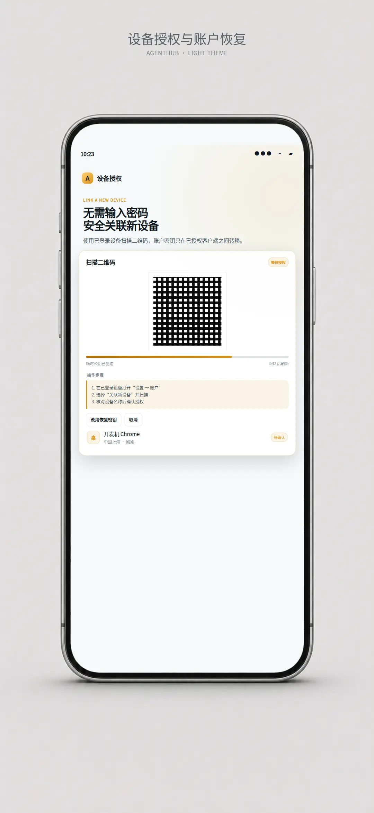
      </a>
      <br>
      <sub><strong>浅色主题</strong> — 扫码步骤、手动恢复入口与待确认状态。</sub>
    </td>
  </tr>
</table>

#### 设备仪表盘与详情

统一查看 Linux、macOS 与 Windows 机器，核对 daemon、CLI、runner、在线状态和文件传输。

<table>
  <tr>
    <td align="center" width="50%">
      <a href="docs/assets/readme/showcase/screens/devices-dark.webp">
        
      </a>
      <br>
      <sub><strong>深色主题</strong> — 设备分组、在线状态、活跃会话与传输进度。</sub>
    </td>
    <td align="center" width="50%">
      <a href="docs/assets/readme/showcase/screens/devices-light.webp">
        
      </a>
      <br>
      <sub><strong>浅色主题</strong> — daemon、CLI 版本、Runner 和设备快捷操作。</sub>
    </td>
  </tr>
</table>

#### 新建远程会话

在一处选择机器、目录、Codex 或 Claude Code、模型、推理强度、权限模式、凭据和 Worktree。

<table>
  <tr>
    <td align="center" width="50%">
      <a href="docs/assets/readme/showcase/screens/new-session-dark.webp">
        
      </a>
      <br>
      <sub><strong>深色主题</strong> — 完整运行环境与初始任务配置。</sub>
    </td>
    <td align="center" width="50%">
      <a href="docs/assets/readme/showcase/screens/new-session-light.webp">
        
      </a>
      <br>
      <sub><strong>浅色主题</strong> — 文件引用、会话模板与隔离 Worktree。</sub>
    </td>
  </tr>
</table>

### 会话与智能体

#### 会话工作台

当前任务按机器和项目组织，同时展示 AgentHub 会话、少量电脑端候选、待审批和完成状态。

<table>
  <tr>
    <td align="center" width="50%">
      <a href="docs/assets/readme/showcase/screens/sessions-dark.webp">
        
      </a>
      <br>
      <sub><strong>深色主题</strong> — 项目分组、执行中、思考中和权限状态。</sub>
    </td>
    <td align="center" width="50%">
      <a href="docs/assets/readme/showcase/screens/sessions-light.webp">
        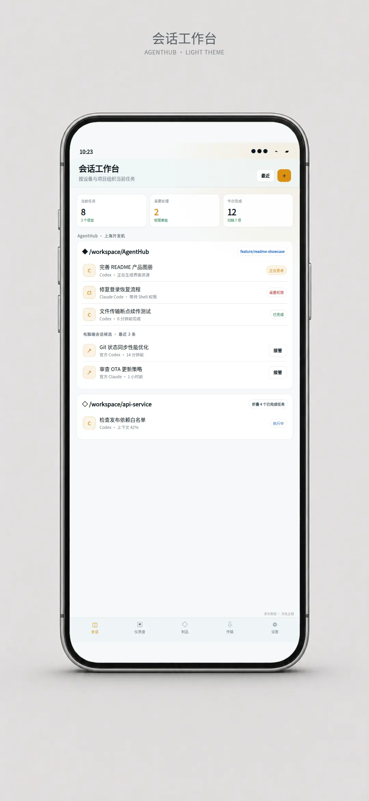
      </a>
      <br>
      <sub><strong>浅色主题</strong> — 电脑端会话候选、接管入口和完成任务折叠。</sub>
    </td>
  </tr>
</table>

#### AI 对话工作台

消息流不仅显示回答，也持续呈现目标进度、上下文用量、思考状态、文件引用和工具执行。

<table>
  <tr>
    <td align="center" width="50%">
      <a href="docs/assets/readme/showcase/screens/conversation-dark.webp">
        
      </a>
      <br>
      <sub><strong>深色主题</strong> — 用户消息、智能体回复、进度更新与代码块。</sub>
    </td>
    <td align="center" width="50%">
      <a href="docs/assets/readme/showcase/screens/conversation-light.webp">
        
      </a>
      <br>
      <sub><strong>浅色主题</strong> — 上下文进度、内联工具状态与多端继续对话。</sub>
    </td>
  </tr>
</table>

#### 工具调用与权限审批

Shell、文件编辑、Diff 与 MCP 调用共享统一状态卡片，危险动作由用户明确批准。

<table>
  <tr>
    <td align="center" width="50%">
      <a href="docs/assets/readme/showcase/screens/tools-dark.webp">
        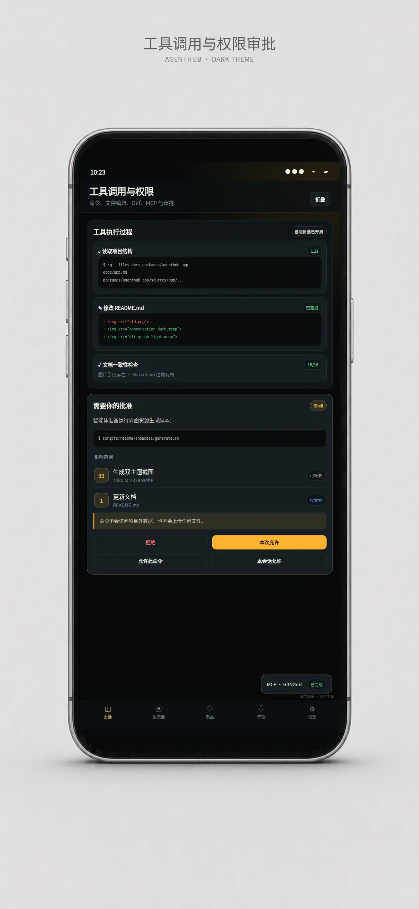
      </a>
      <br>
      <sub><strong>深色主题</strong> — 命令输出、文件修改、Diff 和检查结果。</sub>
    </td>
    <td align="center" width="50%">
      <a href="docs/assets/readme/showcase/screens/tools-light.webp">
        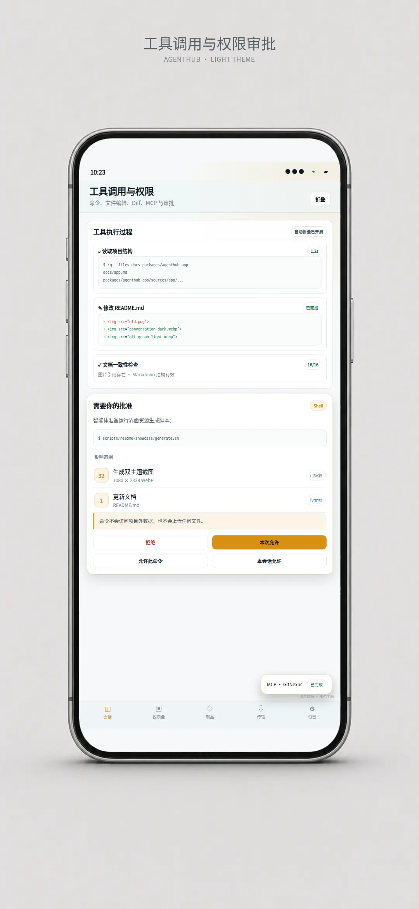
      </a>
      <br>
      <sub><strong>浅色主题</strong> — 拒绝、本次允许、命令级与会话级授权。</sub>
    </td>
  </tr>
</table>

#### 文件管理器与代码预览

浏览在线机器的目录树，搜索并预览代码、Markdown 和图片，再从机器下载到 App。

<table>
  <tr>
    <td align="center" width="50%">
      <a href="docs/assets/readme/showcase/screens/files-dark.webp">
        
      </a>
      <br>
      <sub><strong>深色主题</strong> — 目录树、文件搜索、语法类型和路径信息。</sub>
    </td>
    <td align="center" width="50%">
      <a href="docs/assets/readme/showcase/screens/files-light.webp">
        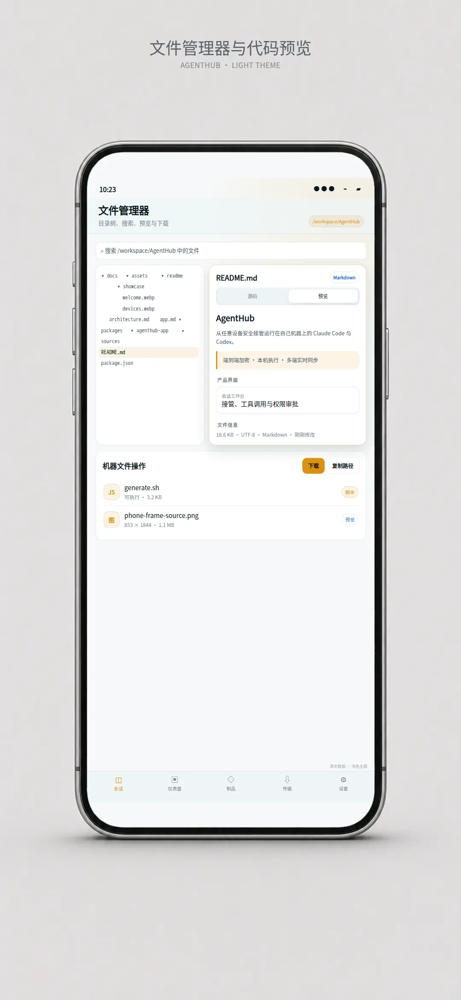
      </a>
      <br>
      <sub><strong>浅色主题</strong> — Markdown 预览、文件信息和下载操作。</sub>
    </td>
  </tr>
</table>

### 文件与 Git

#### 下载与传输管理

机器到 App 的文件传输支持进度、暂停、重试、断线续传、授权目录和本地记录管理。

<table>
  <tr>
    <td align="center" width="50%">
      <a href="docs/assets/readme/showcase/screens/transfers-dark.webp">
        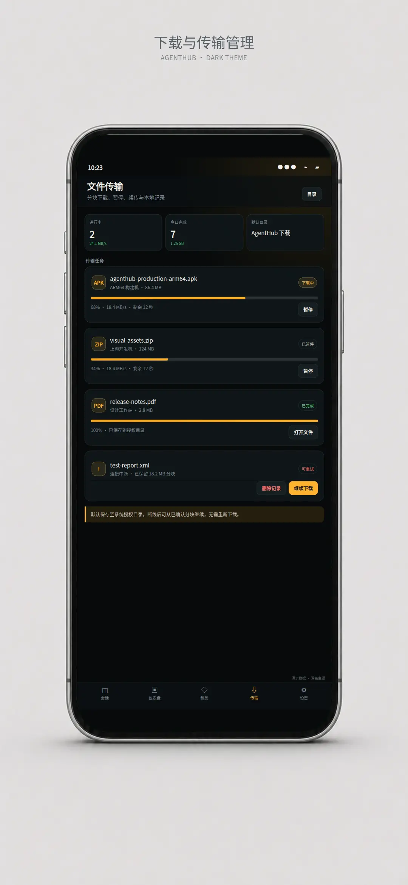
      </a>
      <br>
      <sub><strong>深色主题</strong> — 多任务进度、速度、剩余时间与暂停。</sub>
    </td>
    <td align="center" width="50%">
      <a href="docs/assets/readme/showcase/screens/transfers-light.webp">
        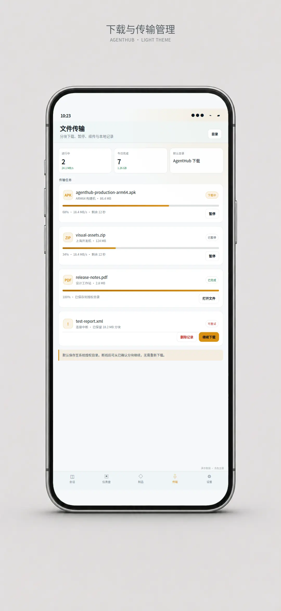
      </a>
      <br>
      <sub><strong>浅色主题</strong> — 完成记录、失败恢复与系统授权目录。</sub>
    </td>
  </tr>
</table>

#### Git 工作区与差异

集中处理暂存、撤销、统一或分栏 Diff、增删行统计和提交信息。

<table>
  <tr>
    <td align="center" width="50%">
      <a href="docs/assets/readme/showcase/screens/git-workspace-dark.webp">
        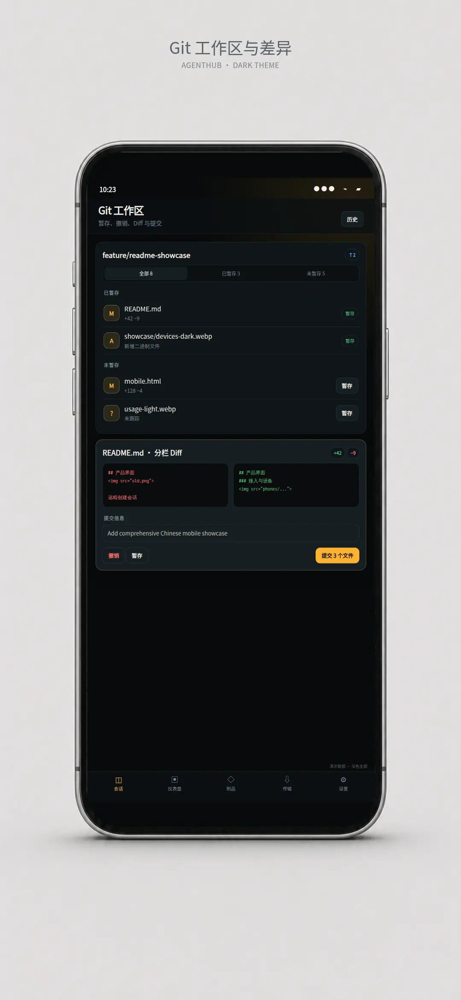
      </a>
      <br>
      <sub><strong>深色主题</strong> — 已暂存、未暂存、未跟踪文件和分支状态。</sub>
    </td>
    <td align="center" width="50%">
      <a href="docs/assets/readme/showcase/screens/git-workspace-light.webp">
        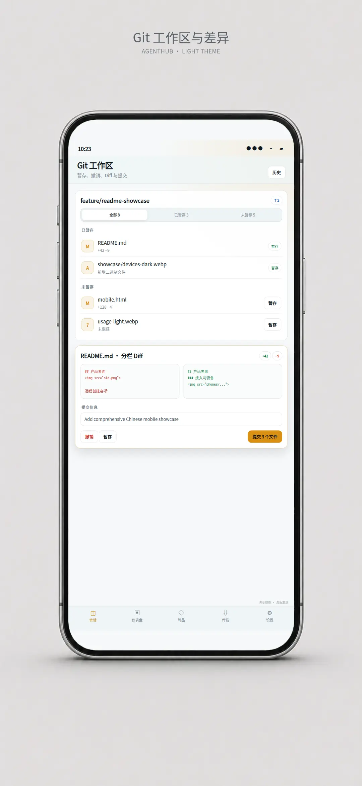
      </a>
      <br>
      <sub><strong>浅色主题</strong> — 分栏 Diff、撤销、暂存和提交。</sub>
    </td>
  </tr>
</table>

#### Git 提交树与详情

查看当前分支、远端、标签、合并节点、作者、父提交和单次提交的文件变化。

<table>
  <tr>
    <td align="center" width="50%">
      <a href="docs/assets/readme/showcase/screens/git-graph-dark.webp">
        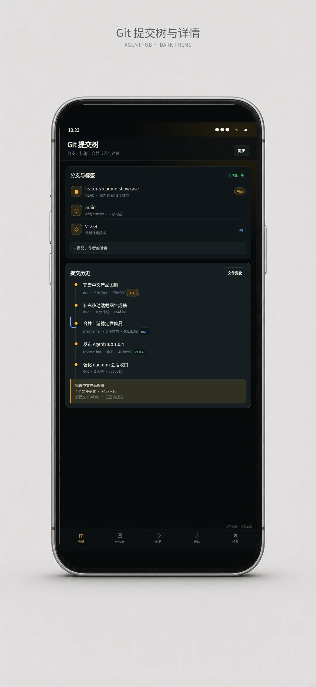
      </a>
      <br>
      <sub><strong>深色主题</strong> — 分支、标签、HEAD 和提交搜索。</sub>
    </td>
    <td align="center" width="50%">
      <a href="docs/assets/readme/showcase/screens/git-graph-light.webp">
        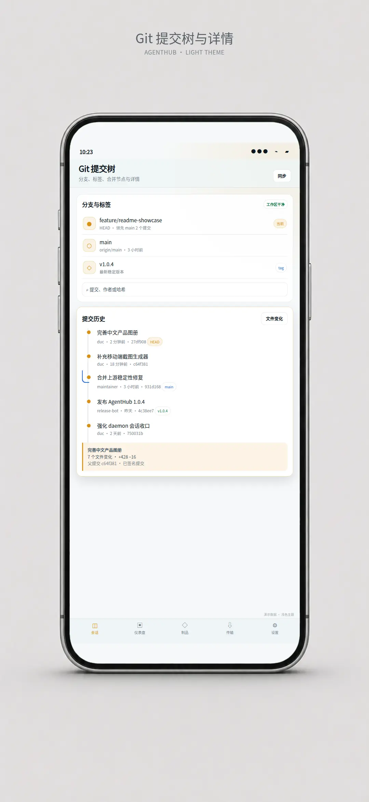
      </a>
      <br>
      <sub><strong>浅色主题</strong> — 提交图、合并节点、哈希和提交详情。</sub>
    </td>
  </tr>
</table>

#### 端到端加密 Artifacts

把发布清单、运行手册和项目笔记作为加密 Artifact 在授权客户端之间同步。

<table>
  <tr>
    <td align="center" width="50%">
      <a href="docs/assets/readme/showcase/screens/artifacts-dark.webp">
        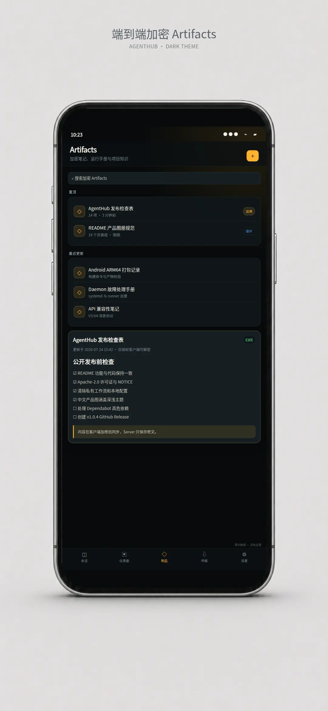
      </a>
      <br>
      <sub><strong>深色主题</strong> — 置顶、搜索、分类和最近更新。</sub>
    </td>
    <td align="center" width="50%">
      <a href="docs/assets/readme/showcase/screens/artifacts-light.webp">
        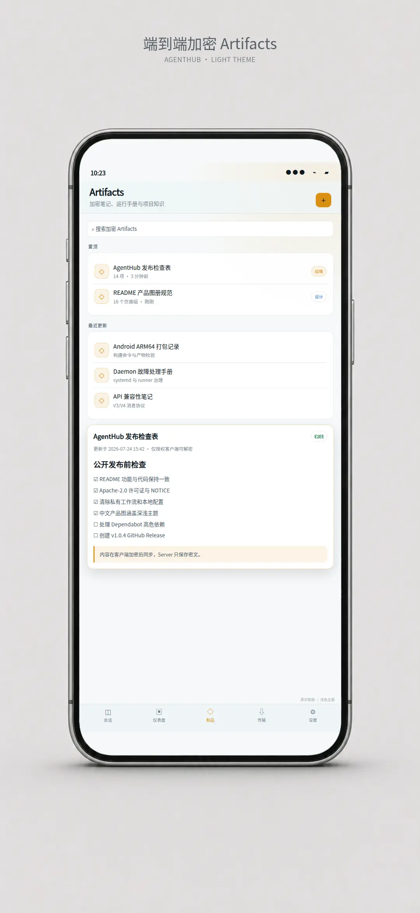
      </a>
      <br>
      <sub><strong>浅色主题</strong> — 加密内容、检查清单和关联资源。</sub>
    </td>
  </tr>
</table>

### 数据、安全与管理

#### 安全外部分享

选中文本后在客户端加密，创建带有效期的临时链接，并随时查看或撤销。

<table>
  <tr>
    <td align="center" width="50%">
      <a href="docs/assets/readme/showcase/screens/secure-share-dark.webp">
        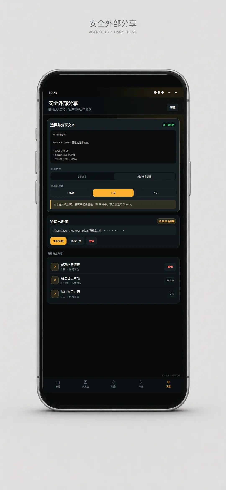
      </a>
      <br>
      <sub><strong>深色主题</strong> — 文本选择、有效期和客户端加密说明。</sub>
    </td>
    <td align="center" width="50%">
      <a href="docs/assets/readme/showcase/screens/secure-share-light.webp">
        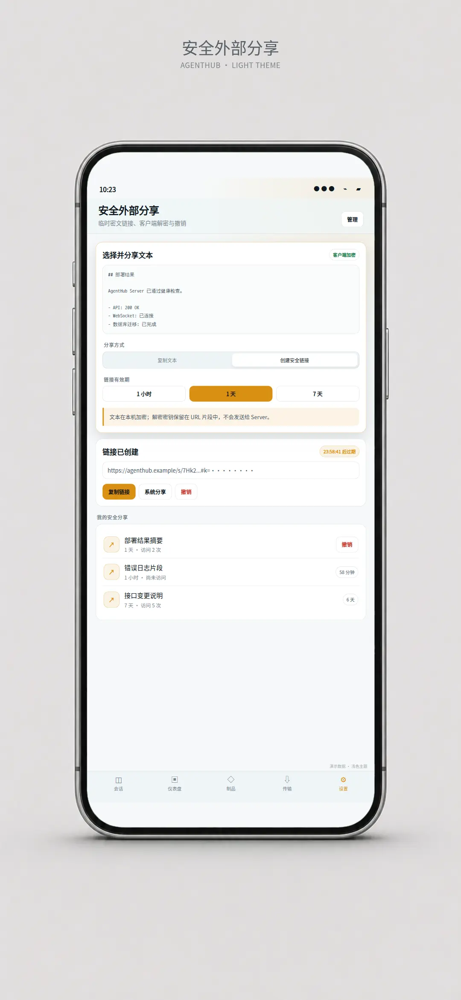
      </a>
      <br>
      <sub><strong>浅色主题</strong> — 链接复制、访问状态和撤销管理。</sub>
    </td>
  </tr>
</table>

#### 模型与 Token 使用情况

按时间、智能体和模型查看 Token、缓存命中、缓存读写与会话数量。

<table>
  <tr>
    <td align="center" width="50%">
      <a href="docs/assets/readme/showcase/screens/usage-dark.webp">
        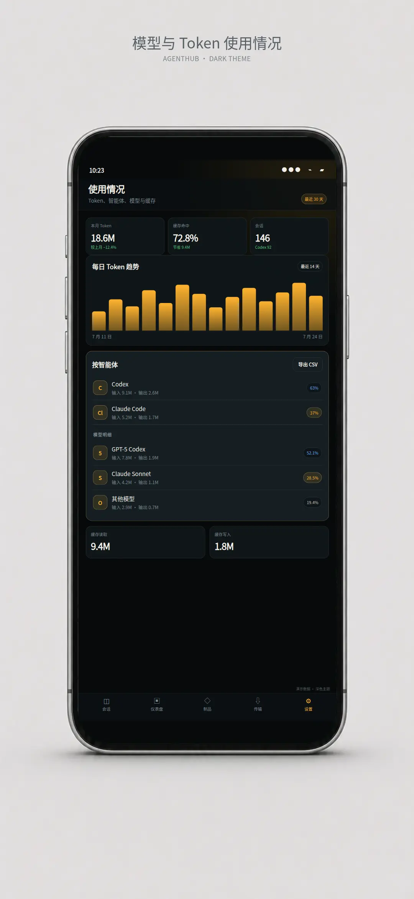
      </a>
      <br>
      <sub><strong>深色主题</strong> — Token 趋势、会话数和缓存命中。</sub>
    </td>
    <td align="center" width="50%">
      <a href="docs/assets/readme/showcase/screens/usage-light.webp">
        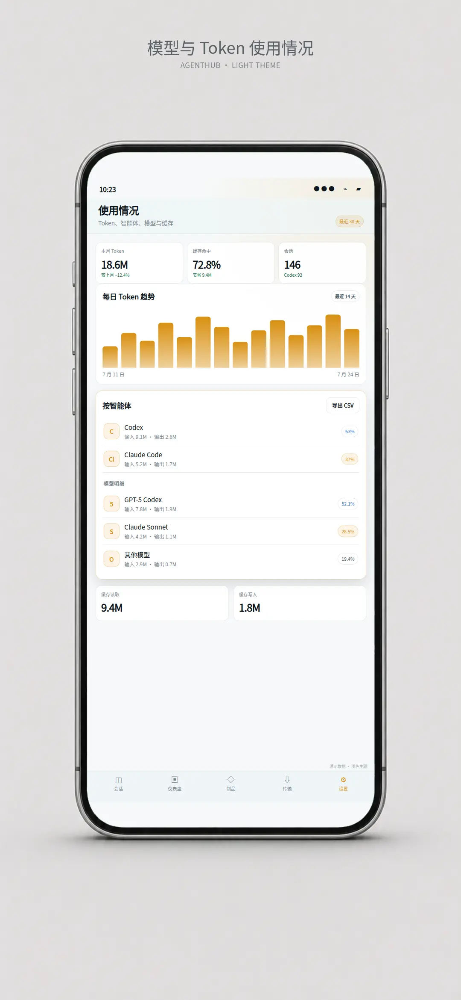
      </a>
      <br>
      <sub><strong>浅色主题</strong> — Codex、Claude Code 与模型用量明细。</sub>
    </td>
  </tr>
</table>

#### 设置、主题与凭据

管理本地加密账户、关联设备、托管 API 凭据、语言、缩放和工作台显示偏好。

<table>
  <tr>
    <td align="center" width="50%">
      <a href="docs/assets/readme/showcase/screens/settings-dark.webp">
        
      </a>
      <br>
      <sub><strong>深色主题</strong> — 账户安全、加密凭据与功能开关。</sub>
    </td>
    <td align="center" width="50%">
      <a href="docs/assets/readme/showcase/screens/settings-light.webp">
        
      </a>
      <br>
      <sub><strong>浅色主题</strong> — 主题、自动折叠、Diff、缩放和语言。</sub>
    </td>
  </tr>
</table>

#### 版本亮点与更新

在 App 内查看版本亮点、OTA 状态和各台机器的 AgentHub CLI 更新情况。

<table>
  <tr>
    <td align="center" width="50%">
      <a href="docs/assets/readme/showcase/screens/changelog-dark.webp">
        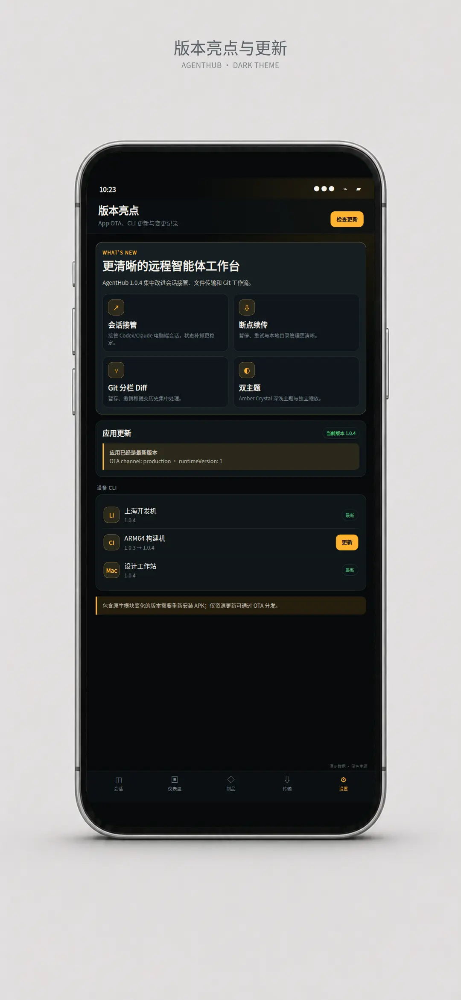
      </a>
      <br>
      <sub><strong>深色主题</strong> — 会话接管、断点续传、Git 与双主题亮点。</sub>
    </td>
    <td align="center" width="50%">
      <a href="docs/assets/readme/showcase/screens/changelog-light.webp">
        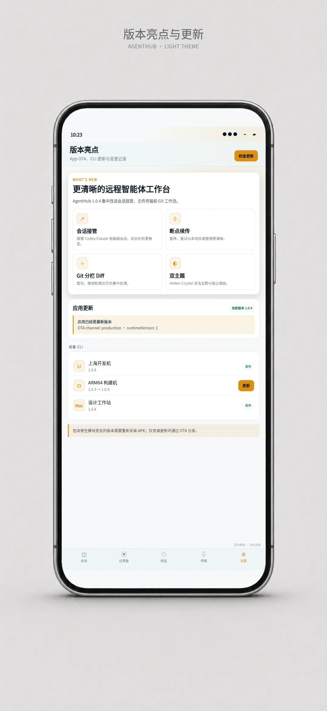
      </a>
      <br>
      <sub><strong>浅色主题</strong> — App OTA、runtimeVersion 与设备 CLI 更新。</sub>
    </td>
  </tr>
</table>

## 3 分钟开始

### 1. 准备本机环境

需要 Node.js 20 或更高版本，并至少安装一个受支持的官方 CLI：

```bash
claude --version
codex --version
```

### 2. 安装 AgentHub CLI

```bash
npm install -g @artsum/agenthub
```

### 3. 登录并接入机器

```bash
agenthub auth login
agenthub auth status
agenthub daemon status
```

首次登录会通过二维码绑定账号，并自动检查当前平台的 daemon 自启动与运行状态。需要手动管理常驻服务时可运行：

```bash
agenthub daemon install
agenthub daemon list
```

### 4. 启动编码代理

```bash
agenthub              # 默认启动 Claude Code
agenthub claude       # 显式启动 Claude Code
agenthub codex        # 启动 Codex
```

在手机、Web 或桌面客户端登录同一账号，即可继续会话。更完整的登录、凭据和远程恢复说明见[快速开始](docs/getting-started.md)。

## 核心能力

| 场景 | 能力 |
| --- | --- |
| 会话工作台 | 按机器和项目组织任务，支持最近会话、高级恢复、官方会话接管、归档与删除。 |
| Claude Code / Codex | 本地或远程创建会话，处理权限请求；Codex 支持动态模型目录、steer、fork 与官方线程恢复。 |
| 机器与文件 | 查看在线机器、远程 RPC、目录浏览、分块下载、暂停重试与断线续传。 |
| 开发上下文 | 在会话内查看 Markdown、Mermaid、工具调用、Git status/diff/log、文件内容与 Artifacts。 |
| 加密数据 | 端到端加密会话、托管凭据、用户 KV，以及可设置有效期和随时撤销的加密文本分享。 |
| 跨平台常驻 | Linux systemd、macOS LaunchAgent、Windows 登录计划任务，以及带检查和回滚的 CLI 自更新。 |
| 自动化控制 | 使用 `agenthub-agent` 列出机器与会话，执行 spawn、send、history、wait 和 stop。 |

完整的能力、实现入口和专题文档对应关系见[功能与代码映射](docs/feature-map.md)。

## 工作原理

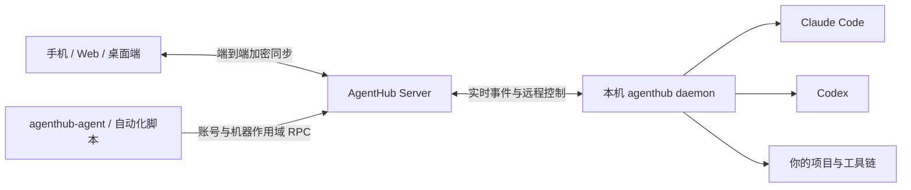

<details>
<summary><strong>查看 AgentHub 完整架构图</strong></summary>
<br>
<a href="docs/assets/diagrams/agenthub-full-architecture.webp">
  
</a>
</details>

- **客户端**保存账号密钥和 UI 状态，拉取快照并接收实时更新。
- **Server**负责认证、路由、排序、密文持久化和多端广播。
- **daemon / runner**在目标机器上启动代理、执行 RPC，并收敛会话生命周期。

详细的数据流、协议和信任边界见[系统架构](docs/architecture.md)、[实时同步与 RPC](docs/realtime-sync-and-rpc.md)和[端到端加密](docs/encryption.md)。

## 自托管

AgentHub Server 提供两种部署形态：

- **标准部署**：PostgreSQL、Redis、S3 兼容对象存储，适合长期运行和横向扩展。
- **Standalone**：PGlite 与本地文件存储，适合个人实例和低门槛试用。

生产环境变量、迁移、反向代理、容器和 systemd 配置见[部署指南](docs/deployment.md)。安全问题请按照[安全政策](SECURITY.md)私下报告。

## 从源码开发

这是一个 pnpm monorepo：

| 组件 | 路径 | 说明 |
| --- | --- | --- |
| App | `packages/agenthub-app` | Expo / React Native / Web / Tauri 客户端。 |
| CLI | `packages/agenthub-cli` | `agenthub` 命令、daemon、runner 生命周期和远程 RPC。 |
| Server | `packages/agenthub-server` | Fastify、Socket.IO、Prisma/PGlite、对象存储和同步 API。 |
| Wire | `packages/agenthub-wire` | 多端共享 Zod schema 与 TypeScript 协议类型。 |
| Agent | `packages/agenthub-agent` | 独立远程控制 CLI。 |

```bash
npx -y pnpm@10.11.0 install
npx -y pnpm@10.11.0 check
npx -y pnpm@10.11.0 web:contract:test
```

开发环境、测试入口和 Android 构建方式见[本地开发环境](docs/dev-environments.md)与[贡献指南](docs/CONTRIBUTING.md)。

## 文档

- [文档索引](docs/README.md)
- [快速开始](docs/getting-started.md)
- [项目当前状态](docs/project-status.md)
- [功能与代码映射](docs/feature-map.md)
- [系统架构](docs/architecture.md)
- [CLI 与 daemon](docs/cli.md)
- [App 架构](docs/app.md)
- [Server 架构](docs/server.md)
- [部署指南](docs/deployment.md)
- [开源发布准备](docs/open-source-release.md)
- [隐私政策](PRIVACY.md)
- [安全政策](SECURITY.md)

## 贡献与许可证

欢迎提交 Issue 和 Pull Request。开始前请先阅读[贡献指南](docs/CONTRIBUTING.md)。

AgentHub 的新增贡献以 [Apache License 2.0](LICENSE) 发布。项目基于 [Happy](https://github.com/slopus/happy) 演进，其原始 MIT 许可证和版权通知继续保留在 [LICENSE-MIT](LICENSE-MIT) 与 [NOTICE](NOTICE) 中。
