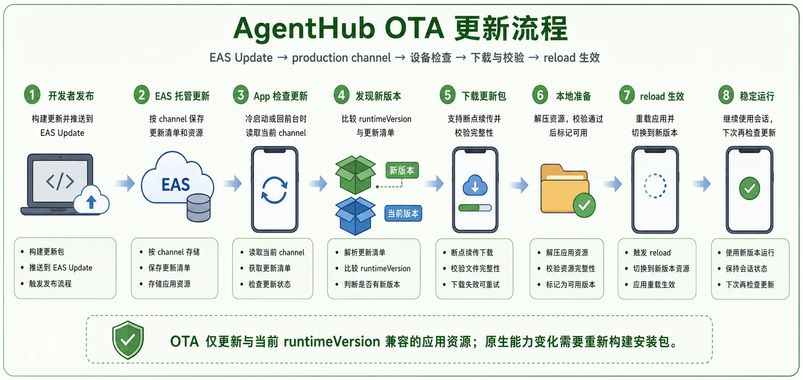

# App 架构

`packages/agenthub-app` 是 AgentHub 的 Expo 应用，覆盖 Android、iOS、Web 和 Tauri 桌面形态。当前 1.0 重点交付 Android arm64 production APK 和 authenticated Web 验证链路；iOS 保留配置与代码支持，但当前 Linux 工作机不做真实设备验证。

## 技术栈

- Expo SDK 55、React 19、React Native 0.83。
- Expo Router 组织页面路由。
- Zustand、MMKV、本地 storage、同步 reducer 管理客户端状态。
- Socket.IO client 负责实时同步。
- libsodium / rn-encryption / react-native-libsodium 负责端侧加密。
- Markdown、diff、文件图标、自定义 AgentHub Amber Crystal 主题用于聊天与文件体验。

## 构建配置

`app.config.js` 由 `APP_ENV` 控制变体：

| `APP_ENV` | 应用名 | bundle/package id |
| --- | --- | --- |
| `development` | `AgentHub (dev)` | `com.artsum.agenthub.dev` |
| `preview` | `AgentHub (preview)` | `com.artsum.agenthub.preview` |
| `production` | `AgentHub` | `com.artsum.agenthub` |

当前用户可见版本为 `1.0.0`，`runtimeVersion` 为 `1`。Android 原生目录已经由 Expo prebuild 生成并纳入当前 1.0 正式包构建；iOS 原生目录仍按 Expo/EAS 流程生成。

服务端地址优先级为：MMKV 中的用户自定义地址、`EXPO_PUBLIC_AGENTHUB_SERVER_URL`、默认 `https://agenthub.yzsd.asia:8443`。该配置保存在独立 `server-config` MMKV 实例中，退出登录后仍保留。

### OTA 更新流程

[](./assets/diagrams/agenthub-ota-update-flow.webp)

OTA 通过 EAS Update 和对应 channel 分发，只应用与当前
`runtimeVersion` 兼容的资源更新。涉及原生模块、权限或其他原生能力变化时，
必须重新构建并安装 Native 包，不能用 OTA 替代。

## Android 本机 APK

当前本机交付包默认使用 `production` 变体：

- 应用名：`AgentHub`。
- 包名：`com.artsum.agenthub`。
- 签名：本地 debug keystore，仅适合内测安装。
- 默认服务端：`https://agenthub.yzsd.asia:8443`。
- CPU ABI：只保留 `arm64-v8a`。
- native 库打包：压缩 `.so`，降低 sideload APK 体积。
- 交付路径：根目录 `artifacts/agenthub-production-arm64-YYYYMMDD-HHMM.apk` 和 `artifacts/agenthub-production-arm64-latest.apk`。

构建命令：

```bash
npx -y pnpm@10.11.0 --filter agenthub-app android:apk:arm64
```

Android OTA 发布和设备侧验证流程见 [deployment.md](./deployment.md) 的“Android OTA 标准流程”。

## 主要页面

| 路径 | 功能 |
| --- | --- |
| `sources/app/(app)/index.tsx` | 会话列表、项目分组和主入口。 |
| `sources/app/(app)/session/[id].tsx` | 会话详情、消息流、输入框、Git 和工具调用展示。 |
| `sources/app/(app)/session/[id]/files.tsx` | 会话文件视图。 |
| `sources/app/(app)/session/[id]/git-log.tsx` | Git 日志和变更详情。 |
| `sources/app/(app)/machines/index.tsx` | 已绑定机器列表。 |
| `sources/app/(app)/machine/[id].tsx` | 单台机器详情。 |
| `sources/app/(app)/new/index.tsx` | 新建或远程启动会话。 |
| `sources/app/(app)/artifacts/*` | Artifacts 列表、新建、编辑、详情。 |
| `sources/app/(app)/settings/*` | 账号、凭据、外观、语言、缩放、用量和实验功能设置。 |
| `sources/app/(app)/restore/*` | 手动恢复/导入相关流程。 |
| `sources/app/(app)/dev/*` | 开发调试页面，仅内部使用。 |

## 同步层

同步代码集中在 `sources/sync`：

- `apiSocket.ts`：Socket.IO 连接、重连、事件订阅和发送。
- `sync.ts` / `ops.ts`：REST 初始拉取、增量合并和操作封装。
- `reducer/reducer.ts`：把服务端更新归并到本地状态。
- `apiCredentials.ts`、`apiArtifacts.ts`、`apiKv.ts`、`apiUsage.ts`、`apiPush.ts`：对应服务端 API 模块。
- `encryption/*`：账号、机器、会话和 artifact 的加解密工具。
- `git-parsers/*`：解析 Git status/diff/branch 输出。

## 设计系统

AgentHub 1.0 使用 `design/Design.md` 定义的 Amber Crystal 设计系统。主题 token、glass primitives、按钮、弹窗、菜单、设置页、会话列表、聊天页、Git/文件面板和启动图已经完成第一轮落地。`docs/assets/agenthub-1.0/` 与 `artifacts/web-visual-audit-20260705/` 是历史证据；当前改动不再新增截图门槛。
